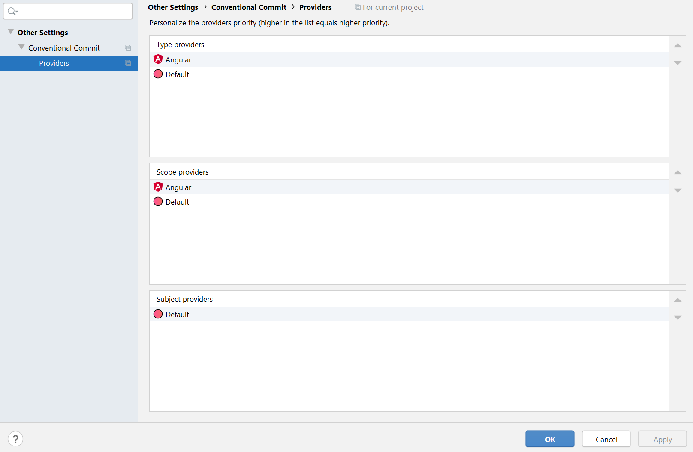

<!--suppress HtmlDeprecatedAttribute, CheckImageSize -->
<h1 align="center">
  
  Conventional Commit
</h1>

  Available at <a href="https://plugins.jetbrains.com/plugin/13389-conventional-commit">JetBrains Marketplace</a>
  /
  <a href="https://github.com/lppedd/idea-conventional-commit/releases">GitHub Releases</a>

## Overview

The **Conventional Commit** plugin provides completion support for [Conventional Commits][conventional-commits]
(also known as semantic commits) in the IDE's VCS modal commit dialog and non-modal commit tool window.

The plugin offers:

- **Standard completion** – context-aware suggestions.
- **Template completion** – triggered on user demand.
- **Extension API** – allowing additional providers for each part of a commit message:
  type, scope, subject, body, and footer.

Writing high-quality commit messages is essential for maintaining a clear and searchable project history.

The Conventional Commits specification is an excellent choice for this, as it also helps streamline
the process of writing commits across teams. However, selecting the correct commit **type** or **scope**
is not always straightforward. It is easy to forget when a particular **type** should be used,
which **scopes** are available, or how to phrase a meaningful **subject**.

This plugin addresses these challenges while respecting the Conventional Commits
[specification][conventional-commits-spec], allowing users to customize the experience
to fit their own workflow and preferences.

### IDE compatibility table

| From Plugin version | From Platform version | To Platform version |
|---------------------|-----------------------|---------------------|
| 0.26.0              | 253.17525             | *                   |
| 0.25.0              | 233.11799             | 253.2*              |
| 0.24.0              | 233.11799             | 251.*               |
| 0.23.0              | 223.4884              | 243.*               |
| 0.19.0              | 202.6397              | 233.*               |

## Completion modes

The plugin offers two completion modes.

### Context-based

The commit message can be written as usual. When you invoke code completion,
you are offered the most appropriate suggestions based on the current context.

Several convenience features are included as well, such as automatically inserting
the **scope** parentheses or the `:<space>` separator.

### Template-based

By first invoking completion for the commit **type** and selecting one of the suggested items,
a commit message template is generated in place. You are then guided through each commit message
token (**scope**, **subject**, **body**, **footer**).

You can move back to previous tokens using `SHIFT + TAB` (on Windows) to change selection.
Instead of accepting a completion suggestion, an arbitrary value may also be typed directly
inside each template range marker.

## Inspections

The plugin includes inspections that warn you whenever a commit message does not follow the
Conventional Commits [specification][conventional-commits-spec]. If an issue is reported,
simply use `CTRL + ALT + L` (on Windows) to automatically fix the commit message.

You can also provide your own inspections by registering implementations of `CommitInspectionProvider`
from a dependant plugin.

### Toggling inspections

Commit message inspections can be enabled or disabled from **Settings > Version Control > Commit**.

## Token documentation

Each commit message token can include documentation, available through the usual Quick Documentation popup.
This is useful whenever you are unsure about the meaning of a suggested item or whenever you are
unsure whether that suggestion may be used in that particular context.

Documentation for tokens that may span multiple lines is rendered slightly differently.

## Custom tokens

Commit **types**, **scopes**, and **footers** can be customized and shared across your team
by creating a file named `conventionalcommit.json` in the project's root directory, or by setting
a file path via **Settings > Conventional Commit, Default tokens**.

The plugin bundles a predefined set of commonly used tokens, which you can export
via the **Export built-in defaults to path...** action-link as a starting point.  

The exported file can then be customized to suit your needs, as long as it conforms
to the associated JSON [schema][schema].

If the file is located in the project's root directory, the plugin will pick it up automatically,
making versioning easy and avoiding explicit file paths.

## Token providers

By default, a fresh installation offers only the most common tokens (e.g., `fix`, `feat`, `build`,
`BREAKING CHANGE`, etc.).

However, the plugin exposes APIs to enhance completion suggestions for each commit message token,
by registering implementations of:

- `CommitTypeProvider`
- `CommitScopeProvider`
- `CommitSubjectProvider`
- `CommitBodyProvider`
- `CommitFooterTypeProvider`
- `CommitFooterValueProvider`

from dependant plugins.

Providers can also be reordered as needed via **Settings > Conventional Commit > Providers**,
with duplicate suggestions automatically filtered out by the core engine.

**More on this coming soon**.

## Author and Contributors

- [Edoardo Luppi](https://github.com/lppedd)
- [ymind](https://github.com/ymind)
- [bric3](https://github.com/bric3)
- [LinWanCen](https://github.com/LinWanCen)

[conventional-commits]: https://conventionalcommits.org/
[conventional-commits-spec]: https://www.conventionalcommits.org/en/v1.0.0/#specification
[schema]: https://github.com/lppedd/idea-conventional-commit/blob/master/src/main/resources/defaults/conventionalcommit.schema.json
